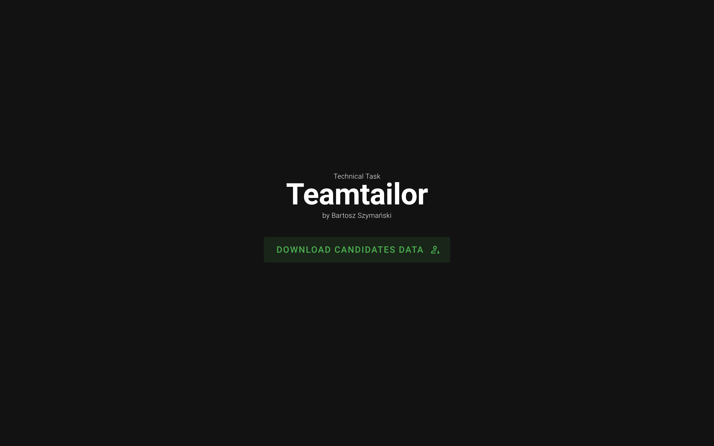

# Teamtailor Technical Task

This is a technical task for Teamtailor. The task is about to create a API integration with Teamtailor's API and also to
introduce simple frontend to let user download the processed data.



## Requirements
- [Docker](https://www.docker.com/) >= 27.2.0 (optional for containerized run)
- [Docker Compose](https://docs.docker.com/compose/) >= 2.29.2-desktop.2 (optional for containerized run)

## Installation

1. Clone the repository

```bash
git clone https://github.com/bartosz-szymanski-dev/teamtailor-technical-task.git
cd teamtailor-technical-task
```

2. Create `.env` file in the `backend` directory and fill it with the following content:

```text
TEAMTAILOR_API_URL=https://api.teamtailor.com/v1
TEAMTAILOR_API_VERSION=20240404
TEAMTAILOR_API_KEY=your-api-key
THROTTLING_MAX_REQUESTS=50
THROTTLING_SECONDS=10
```

3. Docker

```bash
docker-compose up -d
```

4. Check if the containers are running

```bash
docker ps
```

## Usage
Simply open your browser and go to `http://localhost:8080` to access the frontend.
